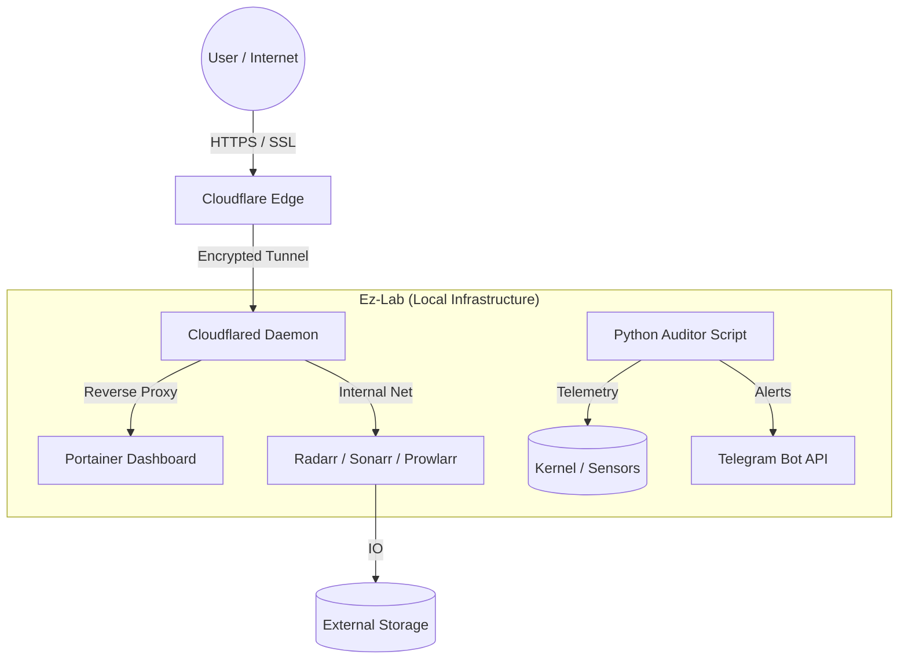

# 🛡️ Ez-Lab: Zero Trust Hybrid Cloud Infrastructure


## 🚀 Project Overview
**Ez-Lab** is a cloud-native home laboratory designed to simulate a production environment on a **Raspberry Pi 5**. The goal was to build a resilient, secure, and automated infrastructure for media streaming, observability, and self-hosting, strictly following **DevSecOps** and **SRE** principles.

This project solves the challenge of accessing local services behind an ISP CGNAT without exposing public ports, utilizing a **Cloudflare Zero Trust** tunnel and automated Python scripting for telemetry.

## 🏗️ Architecture
The system follows a microservices architecture orchestrated by Docker Compose.



## 🛠️ Tech Stack
* **Hardware:** Raspberry Pi 5 (8GB RAM) + NVMe/SSD Storage.
* **OS:** Debian Bookworm (Headless / Hardened).
* **Orchestration:** Docker Compose (Infrastructure as Code).
* **Networking:** Cloudflare Tunnels (Zero Trust).
* **Observability:** Custom Python Scripts (`psutil`), Telegram Alerts.
* **Automation:** Bash Cron Jobs (Self-Healing), *Arr Suite (Media Ops).

## 💡 Key Challenges & Solutions (SRE Journal)

### 1. The CGNAT Barrier (Bypass Architecture)
**Challenge:** My ISP uses CGNAT, making traditional Port Forwarding impossible.
**Solution:** Implemented **Cloudflare Tunnels**. A lightweight daemon (`cloudflared`) creates an outbound-only encrypted connection to the Edge, allowing secure access via HTTPS without exposing public IPs.

### 2. The "Black Box" Problem (Observability)
**Challenge:** Lack of visibility into disk pressure or thermal throttling.
**Solution:** Developed a custom **Python Auditor** located in `/docker/scripts`.
* **Kernel Telemetry:** Uses `psutil` to read `/sys/class/thermal` and disk usage.
* **Alerting:** Integrated with **Telegram API**. Sends push notifications if CPU > 75°C or Disk > 85%.

## 📦 How to Run

1. Clone the repository.

2. Create a `.env` file inside the `docker/` folder:
   ```bash
   # Network Secrets
   TUNNEL_TOKEN=eyJhIjoi...
   TAILSCALE_KEY=tskey-auth-...

   # Alerting Secrets
   TELEGRAM_BOT_TOKEN=your_token_here
   TELEGRAM_CHAT_ID=your_id_here
   ```

3. Deploy the stack:
   ```bash
   cd docker
   docker compose up -d
   ```

4. Setup Python Environment for scripts:
   ```bash
   cd docker/scripts
   python3 -m venv venv
   source venv/bin/activate
   pip install -r requirements.txt
   python3 auditor.py
   ```

## 📂 Repository Structure
* `/docker`: Main `docker-compose.yml` and `.env` file.
* `/docker/scripts`:
    * `auditor.py`: Python telemetry script.
    * `requirements.txt`: Python dependencies.

---
*Built with ❤️ and ☕ by Ez. Hosted on a Raspberry Pi 5.*