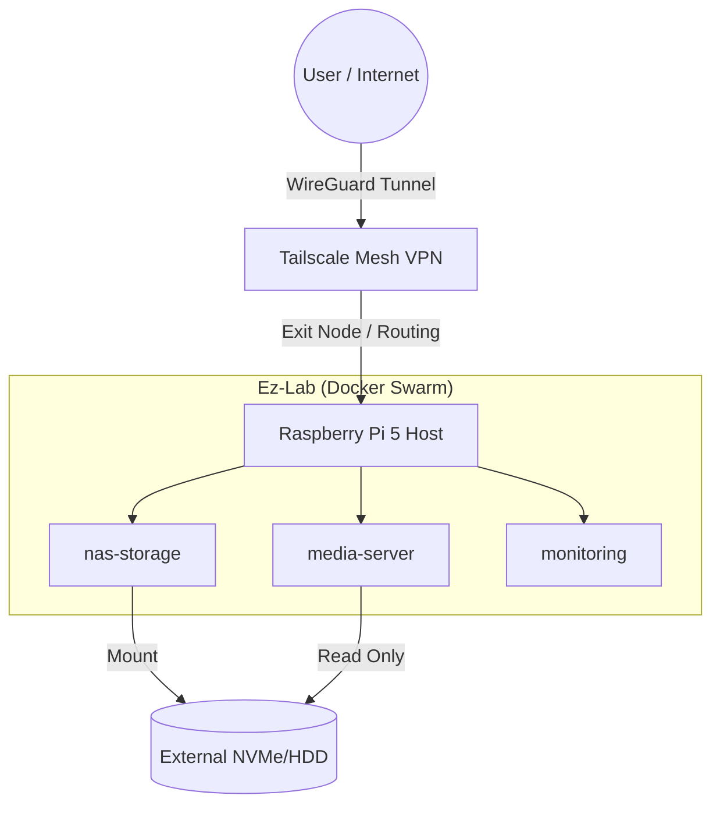

# 🛡️ Ez-Lab: Self-Hosted Cloud Infrastructure


## 🚀 Project Overview
**Ez-Lab** is a cloud-native home laboratory designed to simulate a production environment on a Raspberry Pi 5. The goal was to build a resilient, secure, and automated infrastructure for media streaming and file management, strictly following **DevSecOps** principles.

This project solves the challenge of accessing local services behind an ISP CGNAT without exposing public ports, utilizing a Zero Trust overlay network.

## 🏗️ Architecture
The system follows a microservices architecture orchestrated by Docker Compose.



## 🛠️ Tech Stack
* **Hardware:** Raspberry Pi 5 (8GB RAM) + External Storage.
* **OS:** Debian Bookworm (Headless).
* **Orchestration:** Docker Compose (IaC).
* **Networking:** Tailscale (Mesh VPN, NAT Traversal, Exit Node).
* **Security:** UFW Firewall, SSH Hardening (Ed25519 keys), Non-root user execution.
* **Services:** Jellyfin (Media), Samba (SMB Protocol).

## 💡 Key Challenges & Solutions (SRE Journal)

### 1. The CGNAT Barrier
**Challenge:** My ISP uses CGNAT (Carrier-Grade NAT), making traditional Port Forwarding impossible for remote access.
**Solution:** Implemented **Tailscale** as an overlay network. This allows authenticated access to the lab from anywhere in the world without opening inbound ports on the router, reducing the attack surface to near zero.

### 2. Docker Routing Modules
**Challenge:** The Tailscale container failed to act as an "Exit Node" (VPN Router) because it couldn't modify the host kernel routing tables.
**Solution:** Enabled IP Forwarding on the host (`net.ipv4.ip_forward`) and loaded the necessary kernel modules (`iptable_nat`, `tun`) via `modprobe`, ensuring persistence in `/etc/modules`.

## 📦 How to Run

1.  Clone the repository.
2.  Create a `.env` file with your credentials:
    ```bash
    SAMBA_USER=your_user
    SAMBA_PASS=your_pass
    TAILSCALE_KEY=tskey-auth-xxxxx
    ```
3.  Deploy the stack:
    ```bash
    docker compose up -d
    ```

---
*Built with ❤️ and ☕ by Ez*