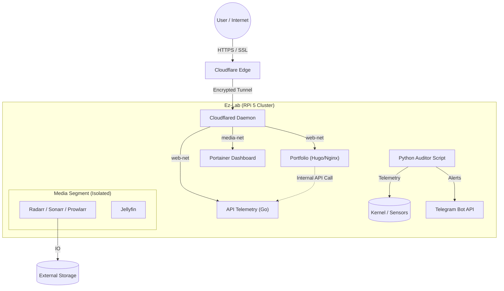

# 🛡️ Ez-Lab: Zero Trust Hybrid Cloud Infrastructure


## 🚀 Project Overview

**Ez-Lab** is a cloud-native home laboratory designed to simulate a production environment on a **Raspberry Pi 5**. The goal was to build a resilient, secure, and automated infrastructure for media streaming, observability, and self-hosting, strictly following **DevSecOps** and **SRE** principles.

This project solves the challenge of accessing local services behind an ISP CGNAT without exposing public ports, utilizing a **Cloudflare Zero Trust** tunnel and automated Python scripting for telemetry.

## 🏗️ Architecture

The system follows a microservices architecture orchestrated by Docker Compose with **Network Segmentation**.



## 🛠️ Tech Stack

* **Hardware:** Raspberry Pi 5 (8GB RAM) + NVMe/SSD Storage.
* **OS:** Debian Bookworm (Headless / Hardened).
* **Orchestration:** Docker Compose (Infrastructure as Code).
* **Networking:** Cloudflare Tunnels (Zero Trust) + Tailscale VPN.
* **Services:**
    * **Web:** Nginx, Hugo, Golang (REST API).
    * **Media:** *Arr Suite, Jellyfin, Samba.
    * **Observability:** Custom Python Scripts (psutil), Telegram Alerts.

## 💡 Key Challenges & Solutions (SRE Journal)

### 1. The CGNAT Barrier (Bypass Architecture)
**Challenge:** My ISP uses CGNAT, making traditional Port Forwarding impossible.
**Solution:** Implemented **Cloudflare Tunnels**. A lightweight daemon (`cloudflared`) creates an outbound-only encrypted connection to the Edge, allowing secure access via HTTPS without exposing public IPs.

### 2. Network Segmentation
**Challenge:** Preventing a vulnerability in the Media stack from affecting the Public Portfolio.
**Solution:** Implemented Docker Networks (`web-net` for public services, `media-net` for internal operations).

### 3. The "Black Box" Problem (Observability)
**Challenge:** Lack of visibility into disk pressure or thermal throttling.
**Solution:** Developed a custom **Python Auditor** located in `/docker/scripts`.
* **Kernel Telemetry:** Uses `psutil` to read `/sys/class/thermal` and disk usage.
* **Alerting:** Integrated with **Telegram API**. Sends push notifications if CPU > 75°C or Disk > 85%.

## 📦 How to Run

1. **Prerequisite:** You must build the Portfolio images locally first (since they live in a separate repo).
   ```bash
   # Clone the Application Repo
   git clone [https://github.com/tu-usuario/portfolio-sre.git](https://github.com/tu-usuario/portfolio-sre.git)
   cd portfolio-sre
   
   # Build the Images (Manual Step)
   docker build -t ez-backend:v1 ./backend
   docker build -t ez-portfolio:v4 ./frontend
   ```

2. **Deploy Infrastructure:**
   Clone this repo and deploy:
   ```bash
   cd ez-lab/docker
   docker compose up -d
   ```

## 📂 Repository Structure

* `/docker`: Main `docker-compose.yml` and `.env` file.
* `/docker/scripts`:
    * `auditor.py`: Python telemetry script.
    * `requirements.txt`: Python dependencies.

---
*Built with ❤️ and ☕ by Ez. Hosted on a Raspberry Pi 5.*