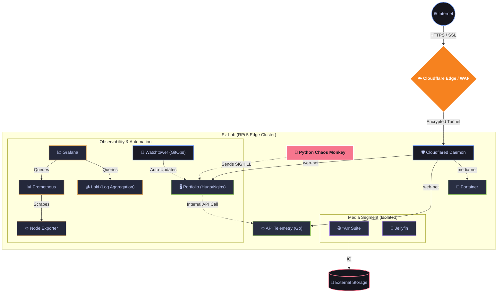

# 🛡️ Ez-Lab: Zero Trust Hybrid Cloud Infrastructure


## 🚀 Project Overview

**Ez-Lab** is a cloud-native home laboratory designed to simulate a production environment on a **Raspberry Pi 5 (Edge Node)**. The goal was to build a resilient, secure, and automated infrastructure for media streaming, observability, and self-hosting, strictly following **DevSecOps** and **SRE** principles.

This project solves the challenge of accessing local services behind an ISP CGNAT without exposing public ports, utilizing a **Cloudflare Zero Trust** tunnel, deep observability, and declarative GitOps automation.

## 🏗️ Architecture Topology

The system follows a microservices architecture orchestrated by Docker Compose with strict **Network Segmentation** and automated resilience testing.


```mermaid
graph TD
    %% Custom Colors (SRE Dark Theme)
    classDef internet fill:#16161e,stroke:#7aa2f7,stroke-width:2px,color:#c0caf5
    classDef cf fill:#f6821f,stroke:#fff,stroke-width:2px,color:#fff,font-weight:bold
    classDef daemon fill:#1a1b26,stroke:#7aa2f7,stroke-width:2px,color:#c0caf5
    classDef app fill:#292e42,stroke:#9ece6a,stroke-width:2px,color:#c0caf5
    classDef media fill:#292e42,stroke:#bb9af7,stroke-width:2px,color:#c0caf5
    classDef hw fill:#16161e,stroke:#f7768e,stroke-width:2px,color:#c0caf5
    classDef obs fill:#24283b,stroke:#e0af68,stroke-width:2px,color:#c0caf5
    classDef chaos fill:#f7768e,stroke:#fff,stroke-width:2px,color:#16161e,font-weight:bold

    User((🌐 Internet)):::internet -->|HTTPS / SSL| Cloudflare{☁️ Cloudflare Edge / WAF}:::cf
    Cloudflare -->|Encrypted Tunnel| Cloudflared[🛡️ Cloudflared Daemon]:::daemon
    
    subgraph "Ez-Lab (RPi 5 Edge Cluster)"
        Cloudflared -->|web-net| Frontend["🖥️ Portfolio (Hugo/Nginx)"]:::app
        Cloudflared -->|web-net| Backend["⚙️ API Telemetry (Go)"]:::app
        Cloudflared -->|media-net| Portainer["🐳 Portainer"]:::app
        
        Frontend -.->|Internal API Call| Backend
        
        subgraph "Media Segment (Isolated)"
            ArrStack["🎬 *Arr Suite"]:::media
            Jellyfin["🍿 Jellyfin"]:::media
        end
        
        subgraph "Observability & Automation"
            Prometheus["📊 Prometheus"]:::obs -->|Scrapes| NodeExporter["⚙️ Node Exporter"]:::obs
            Grafana["📈 Grafana"]:::obs -->|Queries| Prometheus
            Grafana -->|Queries| Loki["🪵 Loki (Log Aggregation)"]:::obs
            Watchtower["🔄 Watchtower (GitOps)"]:::daemon -.->|Auto-Updates| Frontend
        end

        Chaos["🐒 Python Chaos Monkey"]:::chaos -.->|Sends SIGKILL| Frontend
    end
    
    ArrStack -->|IO| HDD[("💾 External Storage")]:::hw
```

## 🛠️ Tech Stack

* **Hardware:** Raspberry Pi 5 (8GB RAM) + NVMe Boot.
* **OS:** Debian Bookworm (Headless / Hardened).
* **Orchestration:** Docker Compose.
* **Networking:** Cloudflare Tunnels (Zero Trust) + Tailscale Mesh VPN.
* **Observability (Enterprise Stack):** Prometheus, Grafana, Loki, Promtail, Uptime Kuma.
* **Automation:** Watchtower (GitOps), Python (Chaos Engineering).

## 💡 Key Challenges & Solutions (SRE Journal)

### 1. The CGNAT Barrier (Bypass Architecture)
**Challenge:** My ISP uses CGNAT, making traditional Port Forwarding impossible.
**Solution:** Implemented **Cloudflare Tunnels**. A lightweight daemon (`cloudflared`) creates an outbound-only encrypted connection to the Edge, allowing secure access via HTTPS without exposing public IPs.

### 2. Network Segmentation
**Challenge:** Preventing a vulnerability in the Media stack from affecting the Public Portfolio.
**Solution:** Implemented isolated Docker Networks (`web-net` for public-facing apps, `media-net` for internal operations).

### 3. The "Black Box" Problem (Deep Observability)
**Challenge:** Lack of visibility into real-time metrics, logs, and external uptime.
**Solution:** Deployed an industry-standard observability stack. Prometheus scrapes hardware data, Loki aggregates container logs (eliminating SSH debugging), and Grafana triggers Telegram webhooks on critical thresholds.

### 4. Chaos Engineering (Resilience Testing)
**Challenge:** Assuming containers will automatically recover is not a metric.
**Solution:** Developed a custom **Python Chaos Monkey** script that randomly sends `SIGKILL` (Exit Code 137) to production containers to validate Docker's declarative restart policies and monitor self-healing recovery times.

## 📦 How to Run

1. **Deploy Infrastructure:**
   Clone this repo and deploy the core services:
   ```bash
   git clone [https://github.com/ezequieldlv/ez-lab.git](https://github.com/ezequieldlv/ez-lab.git)
   cd ez-lab
   docker compose up -d
   ```

2. **Run Chaos Experiments (Optional):**
   ```bash
   python3 scripts/chaos_monkey.py
   ```

## 📂 Repository Structure

* `docker-compose.yml`: The declarative source of truth for the cluster.
* `/prometheus/`: Prometheus scrape configurations.
* `/loki/`: Log aggregation and Promtail parsing rules.
* `/scripts/`: SRE automation scripts (Chaos Monkey, Alerts).

---
*Architected by Ezequiel | Running on bare-metal. Expanding to AWS.*
